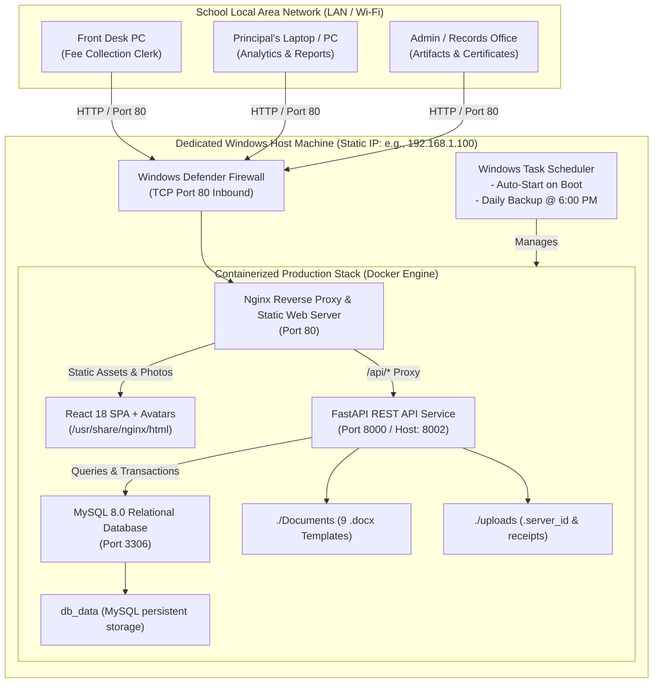
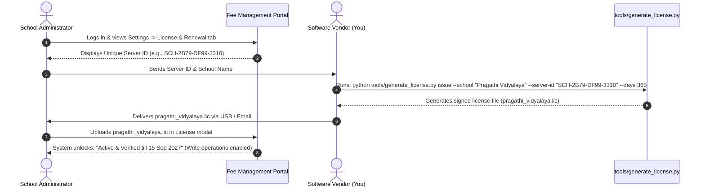
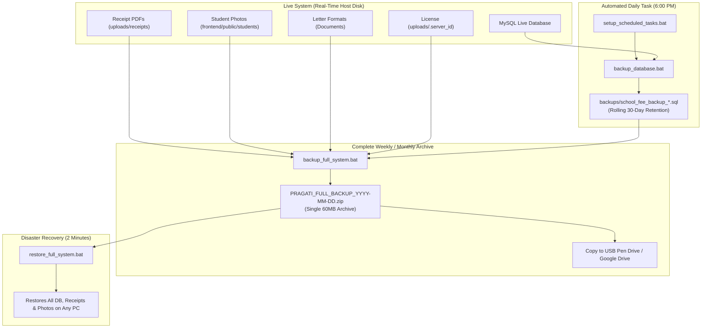

# Enterprise Windows Production Deployment Guide
## Pragati Vidyalaya - School Fee Management & Institutional Documentation System

**Document Version:** 2.0  
**Target Environment:** Production Windows Desktop / Server (Windows 10, Windows 11 Pro, or Windows Server 2019/2022)  
**Classification:** Confidential / Operational Manual  

---

> [!NOTE]
> This guide is designed for school administrators, IT managers, and system engineers deploying the School Fee Management System in a production on-premises environment. It covers turnkey automated deployment via Docker (recommended), alternative native Windows deployment (IIS + Windows Services), hardware-bound offline licensing, multi-PC LAN access, and disaster recovery.

---

## 1. System Architecture & Topology

The School Fee Management System is engineered for **100% offline, on-premises LAN deployment**. No external internet connectivity is required for daily fee transactions, student directory searches, or document printing.



---

## 2. Hardware & Network Prerequisites

### Recommended Server Specifications:
| Component | Minimum Specification | Recommended (Production Server) |
| :--- | :--- | :--- |
| **Operating System** | Windows 10 Pro / Windows 11 Pro | Windows 11 Pro 64-bit or Windows Server 2022 |
| **Processor** | Intel Core i3 / AMD Ryzen 3 (4 Cores) | Intel Core i5 / i7 (6+ Cores) |
| **RAM** | 8 GB DDR4 | 16 GB DDR4 |
| **Storage** | 120 GB SSD | 500 GB NVMe SSD |
| **Network** | 100 Mbps Ethernet / Wi-Fi | 1 Gbps Gigabit Ethernet connected to school switch |
| **Power Backup** | Standard UPS (15 mins) | Online UPS (30+ mins runtime for power surges) |

### Network Configuration (Static IP):
To ensure all school PCs can reliably bookmark the portal, assign a permanent static IP to the host computer:
1. Press `Win + R`, type `ncpa.cpl`, and press **Enter**.
2. Right-click your Ethernet / Wi-Fi adapter -> **Properties**.
3. Double-click **Internet Protocol Version 4 (TCP/IPv4)**.
4. Select **Use the following IP address**:
   - **IP Address**: `192.168.1.100` *(or an unused IP in your router's subnet)*
   - **Subnet Mask**: `255.255.255.0`
   - **Default Gateway**: `192.168.1.1` *(your router's IP)*
5. Click **OK** to apply.

---

## 3. Production Deployment - Method 1: Docker (Recommended)

Docker deployment is the fastest, cleanest, and most reliable method. It bundles Python 3.12, Node.js 20, Nginx, and MySQL 8.0 in isolated containers with zero software version conflicts.

### Step 3.1: Install Docker Desktop
1. Download **Docker Desktop for Windows** from the official Docker website:
   `https://www.docker.com/products/docker-desktop/`
2. Run the installer and ensure **"Use WSL 2 instead of Hyper-V"** is checked.
3. Restart your computer when prompted.
4. Launch Docker Desktop from the Start Menu and verify the status icon in the system tray is green (Engine Running).
5. In Docker Desktop Settings:
   - Navigate to **General** -> Check **"Start Docker Desktop when you log in"**.

### Step 3.2: One-Click Production Deployment
Open the project directory (`fee_management`) on the Windows server:
1. Right-click [`deploy_production.bat`](file:///d:/personal/school/repo/fee_management/deploy_production.bat) and select **Run as administrator**.
2. The automated deployment script will:
   - Verify Docker engine availability.
   - Automatically generate `.env` from `.env.example` if not already present.
   - Ensure `uploads`, `Documents`, and `backups` folders exist.
   - Compile production React assets with bundled student profile photos.
   - Launch MySQL 8.0, FastAPI backend, and Nginx containers.
   - Automatically configure a Windows Defender Firewall rule opening **Port 80** for LAN computers.
   - Display your local IP address (e.g. `http://192.168.1.100`).

### Step 3.3: Verify Deployment
Open your web browser and navigate to:
- **Local Host**: `http://localhost`
- **Other School PCs**: `http://192.168.1.100`
- **Default Credentials**:
  - **Email**: `admin@school.com`
  - **Password**: `admin123`

---

## 4. Production Deployment - Method 2: Native Windows (Without Docker)

For institutions that cannot run Docker or WSL2, the application can run natively using Windows Services and IIS.

### Step 4.1: Install Prerequisites
1. **Python 3.12**: Download from `python.org`. Check **"Add python.exe to PATH"**.
2. **Node.js 20 LTS**: Download from `nodejs.org`.
3. **MySQL Server 8.0**: Download MySQL Community Installer. Install MySQL Server as a Windows service named `MySQL80` on port `3306`.
4. **NSSM (Non-Sucking Service Manager)**: Download `nssm.exe` from `nssm.cc` and place in `C:\Windows\System32`.
5. **IIS & URL Rewrite**:
   - Enable IIS via *Turn Windows features on or off* -> Check **Internet Information Services**.
   - Download and install **IIS URL Rewrite Module 2.1** and **Application Request Routing (ARR) 3.0**.
   - In IIS Manager, click Server Name -> **Application Request Routing Cache** -> **Server Proxy Settings** -> Check **Enable proxy**.

### Step 4.2: Initialize the Database
Open Command Prompt as Administrator in the repository folder:
```cmd
cd D:\personal\school\repo\fee_management
db\setup_db.bat
```
Enter your MySQL root password. The script will create `school_fee_db`, create user `school_user`, and load all 655 students and system tables from `db/init.sql`.

### Step 4.3: Setup Backend as a Windows Service
In Command Prompt:
```cmd
cd D:\personal\school\repo\fee_management\backend
python -m venv venv
venv\Scripts\activate
pip install -r requirements.txt
```

Register the backend as an auto-starting Windows Service with NSSM:
```cmd
nssm install SchoolFeeBackend "D:\personal\school\repo\fee_management\backend\venv\Scripts\uvicorn.exe"
nssm set SchoolFeeBackend AppParameters "app.main:app --host 127.0.0.1 --port 8000"
nssm set SchoolFeeBackend AppDirectory "D:\personal\school\repo\fee_management\backend"
nssm set SchoolFeeBackend Start SERVICE_AUTO_START
nssm start SchoolFeeBackend
```

### Step 4.4: Build and Deploy Frontend to IIS
1. Build the frontend production bundle:
   ```cmd
   cd D:\personal\school\repo\fee_management\frontend
   npm install
   npm run build
   ```
2. Copy contents of `frontend\dist` to `C:\inetpub\wwwroot\school_fees`.
3. In IIS Manager, create a website pointing to `C:\inetpub\wwwroot\school_fees` on Port 80.
4. Add a `web.config` file inside `C:\inetpub\wwwroot\school_fees` with reverse proxy rules for `/api/*` forwarding to `http://127.0.0.1:8000/api/*`.

---

## 5. Offline 1-Year Licensing Configuration

The application includes an offline, Ed25519 asymmetric cryptographic licensing engine.

### How to Activate on a New Server:



### Step-by-Step Vendor License Generation:
On your development or vendor laptop:
```cmd
python tools/generate_license.py issue ^
    --school "Pragati Vidyalaya" ^
    --server-id "<SCHOOL_SERVER_ID>" ^
    --days 365 ^
    --output pragati_vidyalaya_2026.lic
```
Send the resulting `.lic` file to the school administrator. When uploaded via the UI, write operations are immediately unlocked and the countdown timer appears in the top navigation bar.

> [!IMPORTANT]
> The Server ID is persistent and stored in `uploads/.server_id`. In Docker deployments, this folder is mounted into the container, ensuring the license remains valid across server reboots, Docker upgrades, or container rebuilds.

---

## 6. Institutional Artifacts & School Letter Printing

The portal includes a dedicated **Artifacts** module accessible at `http://localhost/artifacts` or from the sidebar menu under **DOCUMENTS & LETTERS**.

### Available Document Formats (10 Official Templates):
1. **Study Certificate** (`Study Certificate Formate.docx`)
2. **Transfer Certificate (TC) Request Letter** (`Transfer Certificate requesting letter.docx`)
3. **Student Academic Undertaking** (`Student Undertaking.docx`)
4. **Suspension Notice** (`Suspension Letter Formate.docx`)
5. **Examination Hall Ticket** (`Hall ticket.docx`)
6. **Teacher Appointment Letter** (`Appointment letter.docx`)
7. **Staff Joining Letter** (`joining letter.docx`)
8. **Experience Certificate** (`Experience Certificate.docx`)
9. **Teacher Service Undertaking** (`Teachers Undertaking Letter.docx`)
10. **Original Documents & Staff NOC** (`Original Marks card collection.docx`)

### Printing Instructions:
1. Open `http://<SERVER_IP>/artifacts`.
2. Click **"Open & Print"** on any letter template.
3. For student documents, type the student name in **Auto-Fill from Student Roster** — the student's name, admission number, grade, father's name, mother's name, DOB, and caste will populate automatically.
4. Modify any custom dates or remarks in the left form fields.
5. Click **"Print Document"** (or press `Ctrl+P`).
6. The system sends an isolated, formatted A4 page with the official **Pragati Vidyalaya** crimson header and Challakere campus address to your printer.

---

## 7. Multi-User LAN Access Configuration

To allow staff members to access the system from their own desks:

### 1. Configure Windows Firewall (Handled automatically by `deploy_production.bat`):
If needed manually, run in an elevated Command Prompt:
```cmd
netsh advfirewall firewall add rule name="School Fee Management System (Port 80)" dir=in action=allow protocol=TCP localport=80
```

### 2. Connect Client PCs:
1. Connect client laptops / desktops to the same school Wi-Fi or Ethernet switch.
2. Open Google Chrome, Microsoft Edge, or Firefox.
3. Type: `http://192.168.1.100` *(replace with your host server's static IP)*.
4. Log in using the clerk or administrator accounts.

### 3. Desktop Shortcut for Staff:
Create a desktop shortcut on the clerk's computer:
1. Right-click on the Desktop -> **New** -> **Shortcut**.
2. Enter location: `http://192.168.1.100`.
3. Name it: **"Pragati Vidyalaya - Fee Management"**.
4. Change icon to a school/ledger icon if desired.

---

## 8. Data Retention & Disaster Recovery Architecture

> [!IMPORTANT]
> **Why your receipts, student photos, documents, and data are NEVER lost when using Docker:**
> Docker containers in this system do **NOT** store data internally. All critical data is bound to your physical Windows hard drive:
> 1. **Receipt PDFs & Uploads**: Mapped directly to `fee_management\uploads\receipts\` on Windows. When a receipt PDF is generated, it is physically written to your Windows hard drive in real time.
> 2. **Official Letterhead Templates**: Mapped directly to `fee_management\Documents\` on Windows.
> 3. **Student Profile Photos**: Extracted directly into `fee_management\frontend\public\students\` on Windows.
> 4. **Hardware License Key**: Saved as `fee_management\uploads\.server_id` on Windows.
> 
> Even if Docker is stopped, uninstalled, or containers are deleted, **all your receipts and files remain completely intact on your Windows drive**.

### Multi-Tier Backup & Retention Strategy:



### Step 8.1: Configure Automated Daily Tasks
Right-click [`setup_scheduled_tasks.bat`](file:///d:/personal/school/repo/fee_management/setup_scheduled_tasks.bat) and select **Run as administrator**.

This configures two automated Windows tasks:
1. **`SchoolFeeManagement_AutoStart`**: Automatically launches all services whenever the computer boots or logs in.
2. **`SchoolFeeManagement_DailyBackup`**: Runs every day at **6:00 PM**, generating a timestamped database snapshot in `fee_management\backups\`.

### Step 8.2: One-Click Complete Institutional Archive
To take a comprehensive backup of **EVERYTHING** (Database SQL + All Receipt PDFs + All Photos + All Word Templates + License Keys):
- Double-click [`backup_full_system.bat`](file:///d:/personal/school/repo/fee_management/backup_full_system.bat).
- Generates a single compressed archive:
  `backups\PRAGATI_FULL_BACKUP_YYYY-MM-DD_HH-mm-ss.zip`
- **Action**: Copy this single ZIP file to a USB pen drive, external hard drive, or cloud storage once a week.

### Step 8.3: Disaster Recovery (Restoring Everything in 2 Minutes)
If the server computer fails, Windows is reinstalled, or you migrate to a new machine:
1. On the new computer, copy the `fee_management` folder.
2. Double-click [`restore_full_system.bat`](file:///d:/personal/school/repo/fee_management/restore_full_system.bat).
3. The restore tool detects the latest full ZIP archive, extracts receipts, photos, and letter templates, and automatically restores all 655 students, fee transactions, and receipts into MySQL.

---

## 9. Maintenance, Upgrades & Troubleshooting

### Updating the Application:
When you receive code updates or new features:
1. Open Command Prompt in the repository folder:
   ```cmd
   git pull
   deploy_production.bat
   ```
2. The script rebuilds the frontend and backend without touching the database volume.

### Resolving Port 80 Conflicts:
If `deploy_production.bat` reports that Port 80 is already in use:
- **Cause**: Windows World Wide Web Publishing Service (IIS), Skype, or SQL Server Reporting Services might be listening on Port 80.
- **Resolution**:
  ```cmd
  net stop w3svc
  sc config w3svc start=disabled
  ```
  Then re-run `deploy_production.bat`.

### Viewing Real-Time Logs:
To check system health and API activity:
```cmd
docker compose logs -f backend
docker compose logs -f db
docker compose logs -f frontend
```

### Emergency Restart:
To cleanly restart all services:
```cmd
docker compose down
docker compose up -d
```

---

## 10. Summary Checklist for Go-Live

| Step | Action | Status |
| :---: | :--- | :---: |
| 1 | Assign Static IP (`192.168.1.100`) to Host Machine | [ ] |
| 2 | Install Docker Desktop with WSL2 backend | [ ] |
| 3 | Run `deploy_production.bat` as Administrator | [ ] |
| 4 | Run `setup_scheduled_tasks.bat` to configure boot auto-start & daily backups | [ ] |
| 5 | Verify login at `http://localhost` (`admin@school.com` / `admin123`) | [ ] |
| 6 | Change default administrator password under System Settings | [ ] |
| 7 | Check Server ID in Settings -> License tab and activate 1-year `.lic` file | [ ] |
| 8 | Open `http://<SERVER_IP>` from a second PC on the school network | [ ] |
| 9 | Test receipt creation and certificate printing at `/artifacts` | [ ] |
| 10 | Run `backup_database.bat` to confirm first production snapshot | [ ] |

---

## 11. Commercial Client Distribution & Source Code Protection (Vendor Guide)

When distributing this software commercially to multiple schools for on-premises installation, **you must protect your proprietary source code** while ensuring the client school retains full ownership of their data (receipts, letter templates, and database).

### 11.1 The Security Vulnerability with Standard Docker Compose
In standard developer mode:
- `docker-compose.yml` mounts `- ./backend:/app`, placing your raw Python (`.py`) files directly on the client's Windows hard drive.
- Anyone can open the folder in VS Code or Notepad to copy, alter, or re-brand your entire intellectual property.

### 11.2 The Commercial Zero-Source Architecture

```mermaid
flowchart TD
    subgraph VendorWorkstation ["Vendor Development Machine (Your PC)"]
        SourceCode["Proprietary Source Code\n- Python (.py)\n- React / TypeScript (.tsx)"]
        CythonEngine["compile_cython.py\n(Cython C-Compiler Engine)"]
        ViteBuild["npm run build\n(Minified React Bundle)"]
        DockerBuilder["Dockerfile.prod\n(Multi-stage Sealed Container)"]
        TarExporter["docker save\n(images/*.tar Sealed Archives)"]
        
        SourceCode --> CythonEngine
        CythonEngine -->|Native C-Binaries (.so)| DockerBuilder
        SourceCode --> ViteBuild
        ViteBuild -->|Sealed Nginx Layer| DockerBuilder
        DockerBuilder --> TarExporter
    end

    subgraph ClientReleaseFolder ["Zero-Source Client USB / ZIP (dist_package/FeeManagement_Release_v1.0)"]
        TarArchives["images/\n- backend_image.tar (Sealed .so)\n- frontend_image.tar\n- mysql_image.tar"]
        ClientCompose["docker-compose.yml\n(Data-only mounts, ZERO source mounts)"]
        ClientDocs["Documents/ (10 Word Templates)"]
        ClientUploads["uploads/ (Receipts & Temp)"]
        ClientScripts["deploy_school.bat\nbackup_full_system.bat\nrestore_full_system.bat\nsetup_client_domain.bat\nsetup_scheduled_tasks.bat"]
    end

    subgraph SchoolServer ["Client School Server (On-Premises Windows PC)"]
        ClientDeploy["1-Click: deploy_school.bat"]
        RunningApp["Running System on LAN\n- 0 Python files on host\n- 0 TypeScript files on host\n- Receipts & DB safely persisted on host disk"]
    end

    TarExporter --> TarArchives
    ClientReleaseFolder --> SchoolServer
    ClientDeploy --> RunningApp
```

### 11.3 Key Architectural Pillars:
1. **Cython Binary Compilation (`compile_cython.py`)**:
   - All 59+ proprietary Python modules in `backend/app/` are transpiled to C and compiled into native machine-code shared libraries (`.so`).
   - Original `.py` and `.c` files are permanently removed from the container.
   - FastAPI type annotations and dependency injection (`Depends`) are fully preserved with `annotation_typing=False, binding=True`.
2. **Minified Static Production Frontend**:
   - React SPA is pre-compiled using Vite (`npm run build`) into minified, tree-shaken JavaScript bundles served by Nginx. Zero `.tsx` source code is exposed.
3. **Data-Only Volume Mounts (`docker-compose.client.yml`)**:
   - The client `docker-compose.yml` mounts **only** data directories:
     ```yaml
     volumes:
       - ./uploads:/app/uploads       # Client receipts saved on Windows host
       - ./Documents:/app/Documents   # Client Word templates on Windows host
     ```
   - **No `- ./backend:/app` mount exists.** There is no Python code on the host machine.
4. **Hardware-Bound RSA License Protection**:
   - The application binds to the client's motherboard/CPU UUID (`.server_id`).
   - Requires your digitally signed 1-year cryptographic license file (`.lic`) to operate.

---

### 11.4 How to Build a Client Release Package (1-Click Vendor Process)

On your development machine:
1. Double-click [`build_distribution.bat`](file:///d:/personal/school/repo/fee_management/build_distribution.bat) (or run `python tools/build_distribution_package.py --zip`).
2. Choose your option:
   - **[1] Full Release Package**: Compiles all Cython `.so` binaries, packages pre-built Docker TAR images, and creates `dist_package/FeeManagement_Release_v1.0.zip`.
   - **[2] Quick Package**: Assembles configuration, Word templates, database initialization, and batch scripts without re-exporting 2GB Docker images (instant dry-run).
   - **[3] 100% Offline Release Package**: Includes pre-built `mysql:8.0` image TAR so client servers with **zero internet connection** can install without downloading anything.
3. Once completed, you will find:
   `dist_package\FeeManagement_Release_v1.0.zip`

---

### 11.5 Delivering and Installing at a Client School

1. **Deliver to Client**:
   - Copy `FeeManagement_Release_v1.0.zip` to a USB pen drive.
   - Extract the ZIP on the client school's Windows server PC (e.g., to `C:\FeeManagement\`).
2. **Execute Deployment**:
   - Right-click [`deploy_school.bat`](file:///d:/personal/school/repo/fee_management/deploy_school.bat) -> **"Run as administrator"**.
   - The script automatically:
     - Detects Docker Desktop.
     - Loads `backend_image.tar`, `frontend_image.tar`, and `mysql_image.tar` into the local Docker engine.
     - Creates local persistent folders (`uploads\receipts`, `Documents`, `backups`).
     - Launches all services using `docker compose up -d`.
     - Opens Port 80 in Windows Defender Firewall.
     - Displays the server LAN IP address.
3. **Automate Scheduled Tasks**:
   - Right-click `setup_scheduled_tasks.bat` -> **"Run as administrator"** to configure boot auto-start and 6:00 PM daily backups.
4. **Issue License**:
   - Have the school administrator log in to `http://localhost` (`admin@school.com` / `admin123`).
   - Under **System Settings -> License & Renewal**, copy their unique **Server ID** (e.g., `SCH-2B79-DF99-3310`).
   - On your vendor PC, double-click [`generate_license.bat`](file:///d:/personal/school/repo/fee_management/generate_license.bat), paste their Server ID, and enter validity (e.g. 365 days).
   - Send the generated `.lic` file to the school.
   - The school administrator clicks "Upload License File" to activate their subscription.
   - *For comprehensive vendor instructions, see [`License_Generation_Guide.md`](file:///d:/personal/school/repo/fee_management/License_Generation_Guide.md).*
